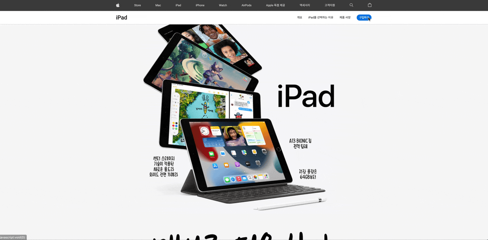

# 1. Apple iPad Responsive Web Site


- HTML, CSS, Javascript를 활용하여 만든 애플 아이패드 반응형 웹사이트 입니다.

### Git Link

[https://github.com/AppleKimkijun/iPad](https://github.com/AppleKimkijun/iPad)

### Web Link

[iPad 10.2](https://applekimkijun-ipad.netlify.app/)

### Responsive 이미지 바로보기

- 화면을 50% 로 보시면 이쁘게 보실 수 있습니다!

Mobile <br>
[iPad-mobile740.app.pdf](./images/iPad-mobile740.app.pdf)

Tablet <br>
[iPad-tablet1000.app.pdf](./images/iPad-tablet1000.app.pdf)

# 2.  Web 설명

## 2-1 검색


- 아이콘을 클릭하면 검색 기능을 활성화 시킬 수 있습니다.
    1. 아이콘을 클릭했을때 헤더에 서칭 클래스를 추가
    2. HTML fixed로 스크롤을 못내리게 만들고
    3. 각각의 메뉴가 검색 아이콘을 누르면 자연스럽게 사라지고 나타나게
    4. 서치 안에 있는 내용들도 마찬가지로 자연스럽게 나타나고 사라지게
    5. setTimeOut을 사용하여 서치 화면이 전부 나타났을때 검색에 focus 해주기

```Javascript
// 검색!
const headerEl = document.querySelector('header')
const headerMenuEls = [...headerEl.querySelectorAll('ul.menu li')]
const searchWrapEl = headerEl.querySelector('.search-wrap')
const searchStarterEl = headerEl.querySelector('.search-starter')
const searchCloserEl = headerEl.querySelector('.search-closer')
const searchShadowEl = headerEl.querySelector('.shadow')
const searchInputEl = searchWrapEl.querySelector('input')
const searchDelayEls = [...searchWrapEl.querySelectorAll('li')]

searchStarterEl.addEventListener('click',showSearch);

searchCloserEl.addEventListener('click',function(event) {
    event.stopPropagation()
    hideSearch()
});

searchShadowEl.addEventListener('click',hideSearch);

// 돋보기 버튼을 눌렀을때 함수
// 1. 헤더에 서칭 클래스 추가
// 2. HTML fixed로 스크롤 못내리게
// 3. 각각의 메뉴에 딜레이를 줘서 자연스럽게 사라지고 나타나게
// 4. 서치 안에 있는 내용들도 자연스럽게 사라지고 나타나게 
// 5. setTimeOut으로 서치 화면이 전부 나왔을때 focus 해주기
function showSearch() {
    headerEl.classList.add('searching');
    stopScroll()
    headerMenuEls.reverse().forEach(function (el, index) {
        el.style.transitionDelay = index * .4 / headerMenuEls.length + 's'
    });
    searchDelayEls.forEach(function (el, index) {
        el.style.transitionDelay = index * .4 / searchDelayEls.length + 's'
    });
    setTimeout(function () {searchInputEl.focus()}, 600)
}

function hideSearch() {
    headerEl.classList.remove('searching')
    playScroll()
    headerMenuEls.reverse().forEach(function (el, index) {
        el.style.transitionDelay = index * .4 / headerMenuEls.length + 's'
    });
    searchDelayEls.reverse().forEach(function (el, index) {
        el.style.transitionDelay = index * .4 / searchDelayEls.length + 's'
    });
    searchDelayEls.reverse()
    searchInputEl.value =''
}

function playScroll() {
    document.documentElement.classList.remove("fixed")
}

function stopScroll() {
    document.documentElement.classList.add("fixed");
}
```

## 2-2 장바구니



- 장바구니 항목을 누르면 내용을 확인할 수 있습니다.
    1. 화면을 눌러도 장바구니 항목이 닫힐 수 있게 만들었고
    2. 장바구니 내부를 눌렀을때 버블링이 일어나기에 stopPropagation을 사용해 버블링을 막았습니다.

```Javascript
// 장바구니
const basketStarterEl = document.querySelector("header .basket-starter");
const basketEl = basketStarterEl.querySelector(".basket");

// 장바구니 토글 만들기 + stopPropagation을 사용해서 버블링막기 + 아무곳이나 눌러도 장바구니 창 닫기
basketStarterEl.addEventListener('click', function(event) {
    event.stopPropagation();
    if (basketEl.classList.contains('show')) {
        //hide
        hideBasket();
    }else {
        //show
        showBasket();
    }
});
basketEl.addEventListener('click',function(event) {
    event.stopPropagation();
});

window.addEventListener('click',function () {
    hideBasket();
    // hideSearch();
});
```

## 2-3 스크롤 이벤트


- 정보 부분들이 화면에 보이면 .show 클래스를 붙여서 화면에 보이도록 했습니다

```Javascript
// 요소의 가시성 관찰
// .info를 찾아서 info들을 .observe 화면에 보이는지 체크
// 체크를 하면서 entries들은 foreach를 돌면서 entry로 하나씩 보이면 .show라는 클래스를 붙여주고
// 그리고 !Intersectiong 이 false면 함수를 빠져나가기
const io = new IntersectionObserver(function (entries) {
    entries.forEach(function(entry) {
        if (!entry.isIntersecting) {
            return
        }
        entry.target.classList.add('show')
    })
})

const infoEls = document.querySelectorAll('.info')
infoEls.forEach(function(el) {
    io.observe(el)
})
```

## 2-4 아이콘 애니메이션


- 여러 이미지를 하나의 이미지로 합쳐서 움직이는 아이콘 처럼 만들었습니다.
- 키 프레임을 활용하여 이미지를 퍼센트로 나누었고 각 퍼센트 마다 화면에 보여질 이미지 값을 넣었습니다.


```css
@keyframes sprite-icon {
  /* 1~10 */
  0.00% { background-position: 0 0; }
  1.67% { background-position: -100px 0; }
  3.33% { background-position: -200px 0; }
  5.00% { background-position: -300px 0; }
  6.67% { background-position: -400px 0; }
  8.33% { background-position: -500px 0; }
  10.00% { background-position: 0 -100px; }
  11.67% { background-position: -100px -100px; }
  13.33% { background-position: -200px -100px; }
  15.00% { background-position: -300px -100px; }

  /* 11~20 */
  16.67% { background-position: -400px -100px; }
  18.33% { background-position: -500px -100px; }
  20.00% { background-position: 0 -200px; }
  21.67% { background-position: -100px -200px; }
  23.33% { background-position: -200px -200px; }
  25.00% { background-position: -300px -200px; }
  26.67% { background-position: -400px -200px; }
  28.33% { background-position: -500px -200px; }
  30.00% { background-position: 0 -300px; }
  31.67% { background-position: -100px -300px; }

  /* 21~30 */
  33.33% { background-position: -200px -300px; }
  35.00% { background-position: -300px -300px; }
  36.67% { background-position: -400px -300px; }
  38.33% { background-position: -500px -300px; }
  40.00% { background-position: 0 -400px; }
  41.67% { background-position: -100px -400px; }
  43.33% { background-position: -200px -400px; }
  45.00% { background-position: -300px -400px; }
  46.67% { background-position: -400px -400px; }
  48.33% { background-position: -500px -400px; }

  /* 31~40 */
  50.00% { background-position: 0 -500px; }
  51.67% { background-position: -100px -500px; }
  53.33% { background-position: -200px -500px; }
  55.00% { background-position: -300px -500px; }
  56.67% { background-position: -400px -500px; }
  58.33% { background-position: -500px -500px; }
  60.00% { background-position: 0 -600px; }
  61.67% { background-position: -100px -600px; }
  63.33% { background-position: -200px -600px; }
  65.00% { background-position: -300px -600px; }

  /* 41~50 */
  66.67% { background-position: -400px -600px; }
  68.33% { background-position: -500px -600px; }
  70.00% { background-position: 0 -700px; }
  71.67% { background-position: -100px -700px; }
  73.33% { background-position: -200px -700px; }
  75.00% { background-position: -300px -700px; }
  76.67% { background-position: -400px -700px; }
  78.33% { background-position: -500px -700px; }
  80.00% { background-position: 0 -800px; }
  81.67% { background-position: -100px -800px; }

  /* 51~60 */
  83.33% { background-position: -200px -800px; }
  85.00% { background-position: -300px -800px; }
  86.67% { background-position: -400px -800px; }
  88.33% { background-position: -500px -800px; }
  90.00% { background-position: 0 -900px; }
  91.67% { background-position: -100px -900px; }
  93.33% { background-position: -200px -900px; }
  95.00% { background-position: -300px -900px; }
  96.67% { background-position: -400px -900px; }
  98.33% { background-position: -500px -900px; }
}
```

- 자바 스크립트로 각 프레임 위치 및 속성 값 만들기

```Javascript
let x = 0
let y = 0
let frames = ''
for (let i = 0; i < 60; i += 1) {
  // frames += `${(100 / 60 * i).toFixed(2)}% { background-position: ${x}px ${y}px; }<br />` // HTML으로 출력!
  frames += `${(100 / 60 * i).toFixed(2)}% { background-position: ${x}${x === 0 ? '' : 'px'} ${y}${y === 0 ? '' : 'px'}; }\n`
  if (x <= -500) {
    x = 0
    y -= 100
    continue // 현재 반복을 종료하고 다음 반복으로 넘어가기!
  }
  x -= 100
}
// document.body.innerHTML = frames // HTML으로 출력!
console.log(frames)
```